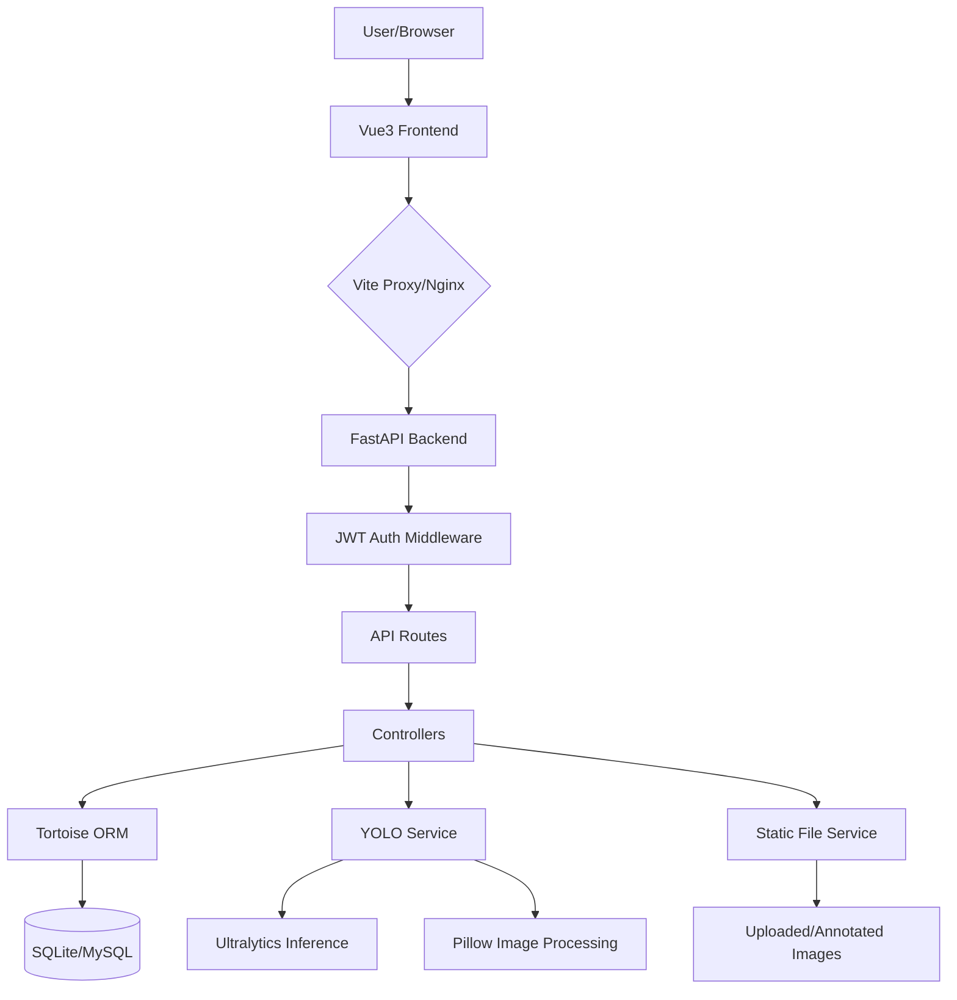

<p align="center">
  
</p>

<h1 align="center">Smart Food Eye (食智眸)</h1>

<p align="center">
  <b>A full-stack admin system based on FastAPI + Vue3 + Naive UI, featuring YOLO deep learning food recognition.</b>
</p>

<p align="center">
  <a href="https://github.com/mizhexiaoxiao/vue-fastapi-admin">
    
  </a>
  <a href="https://github.com/mizhexiaoxiao/vue-fastapi-admin/blob/main/LICENSE">
    
  </a>
  
  
  
</p>

English | [简体中文](./README.md)

---

## 🌟 Introduction

**Smart Food Eye** is a full-stack Web application designed for health management and dietary monitoring. It provides a comprehensive RBAC (Role-Based Access Control) admin framework and deeply integrates **YOLO (You Only Look Once)** food recognition technology. Users can upload food images to identify types in real-time and receive detailed nutritional analysis (calories, protein, fat, etc.), helping them manage their diet scientifically.

This project is suitable as a template for undergraduate graduation projects or small-to-medium enterprise management backends, balancing cutting-edge technology (FastAPI async architecture, YOLOv8 model) with engineering practicality.

## ✨ Key Features

- **🍱 Food Recognition**: Integrated YOLOv8 model for multi-object detection, automatic nutritional calculation, history management, and visualization.
- **🔐 Robust Permissions**: Fine-grained RBAC for users, roles, menus, departments, and APIs.
- **🚀 Modern Tech Stack**:
  - **Backend**: FastAPI (Python 3.11) + Tortoise ORM + JWT + SQLite (supports MySQL/PostgreSQL).
  - **Frontend**: Vue 3 (Composition API) + Vite + Naive UI + Pinia + UnoCSS.
- **📊 Data Visualization**: ECharts-powered dashboards for nutrition ratios, calorie distribution, and historical trends.
- **📝 Audit Logs**: Complete user operation logging for security and traceability.
- **🛠️ Rapid Development**: Encapsulated CRUD, common components, and coding standards.
- **🐳 Containerization**: Docker support for one-click build and deployment.

## 🏗️ Architecture



## 🚀 Quick Start

### 1. Prerequisites

- **Python**: 3.11+ (Recommend [uv](https://github.com/astral-sh/uv) for dependency management)
- **Node.js**: 18.0+
- **PNPM**: 8.0+

### 2. Clone the Repository

```bash
git clone https://github.com/mizhexiaoxiao/vue-fastapi-admin.git
cd vue-fastapi-admin
```

### 3. Backend Setup (FastAPI)

```bash
# Sync dependencies with uv
uv sync

# Database migration (First time only)
# Note: SQLite is used by default with an initial db.sqlite3
# To regenerate:
# aerich init -t app.settings.TORTOISE_ORM
# aerich init-db

# Start the server (Default port 9999)
python run.py
```

### 4. Frontend Setup (Vue3)

```bash
cd web

# Install dependencies
pnpm install

# Run locally (Default port 3100)
pnpm dev
```

Access: `http://localhost:3100`  
Default Credentials: `admin` / `123456`

---

## ⚙️ Configuration

### Environment Variables

**Frontend (`web/.env`)**:
- `VITE_TITLE`: Page title
- `VITE_PORT`: Run port
- `VITE_BASE_API`: Backend API base URL (Default `/api/v1`)

**Backend (`app/settings/config.py`)**:
- `SECRET_KEY`: JWT secret key
- `TORTOISE_ORM`: Database connection (Default SQLite)
- `CORS_ORIGINS`: List of allowed CORS origins

### Directory Structure

```text
vue-fastapi-admin/
├── app/                # Backend core code
│   ├── api/            # API routes (v1)
│   ├── controllers/    # Business logic controllers
│   ├── core/           # Middlewares, dependencies, exceptions
│   ├── models/         # DB models (Tortoise ORM)
│   ├── schemas/        # Pydantic schemas
│   ├── services/       # External services (YOLO)
│   ├── settings/       # App settings
│   └── utils/          # Utilities (JWT, Password)
├── web/                # Frontend core code
│   ├── src/
│   │   ├── api/        # API calls
│   │   ├── components/ # Common/Business components
│   │   ├── layout/     # Page layout
│   │   ├── store/      # Pinia stores
│   │   └── views/      # Pages (incl. Food Recognition)
├── deploy/             # Deployment (Static, Nginx)
├── weights/            # YOLO weights (.pt)
├── pyproject.toml      # Backend dependencies (uv)
└── package.json        # Frontend dependencies (pnpm)
```

---

## 🧪 Testing

Scripts for functionality verification:
- **Food Recognition**: `python test_recognition.py`
- **API Test**: `python test_food_api.py`
- **Flow Validation**: `python test_flow.py`

## 📦 Build & Deploy

### Production Build

```bash
# Frontend build
cd web
pnpm build

# Backend (Run run.py or use uvicorn)
```

### Docker Deployment

```bash
# Build image
docker build -t smart-food-eye .

# Run container
docker run -d -p 9999:9999 -p 3100:3100 smart-food-eye
```

---

## ❓ FAQ

**Q1: `ModuleNotFoundError` when starting backend?**
A: Ensure you have run `uv sync` or installed all dependencies in `pyproject.toml`. Pay special attention to `ultralytics` and `opencv-python-headless`.

**Q2: Food recognition shows "Request error" or image won't load?**
A: 
1. Check backend console for error logs.
2. Ensure `deploy/static/uploads` directory exists and has write permissions.
3. Check `VITE_BASE_API` in frontend `.env`.

**Q3: How to switch to MySQL?**
A: Uncomment the MySQL section in `app/settings/config.py` (`TORTOISE_ORM`) and install `tortoise-orm[asyncmy]`.

**Q4: YOLO model detects nothing?**
A: Ensure a valid `.pt` weight file exists in `weights/`, and the image is clear with the food properly framed.

---

## 📝 Changelog

- **v0.2.0 (2026-03)**:
  - ✨ Added YOLOv8 food recognition module.
  - 📊 Added nutrition analysis dashboard.
  - 🖼️ Optimized image display and annotation.
  - 🛠️ Switched to `uv` for backend dependency management.
- **v0.1.0 (2025-12)**:
  - 🎉 Initial release with RBAC admin framework.

## 🤝 Contributing

1. Fork the project.
2. Create your Feature Branch (`git checkout -b feature/AmazingFeature`).
3. Commit your changes (`git commit -m 'Add some AmazingFeature'`).
4. Push to the Branch (`git push origin feature/AmazingFeature`).
5. Open a Pull Request.

## 📄 License

Distributed under the [MIT License](./LICENSE).

## 👨‍💻 Credits

- **Author**: [mizhexiaoxiao](https://github.com/mizhexiaoxiao)
- **Special Thanks**: 
  - [FastAPI](https://fastapi.tiangolo.com/)
  - [Vue.js](https://vuejs.org/)
  - [Naive UI](https://www.naiveui.com/)
  - [Ultralytics](https://ultralytics.com/) (YOLOv8)
