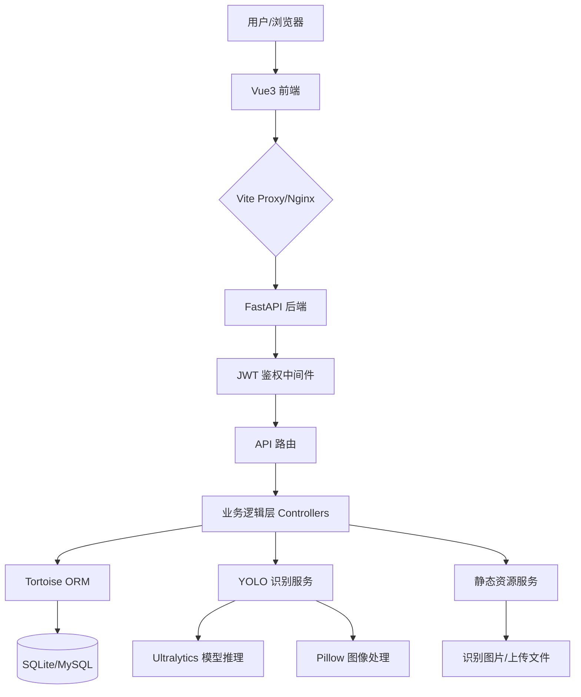

<p align="center">
  
</p>

<h1 align="center">食智眸 (Smart Food Eye)</h1>

<p align="center">
  <b>基于 FastAPI + Vue3 + Naive UI 的全栈后台管理系统，集成 YOLO 深度学习食物识别模块</b>
</p>

<p align="center">
  <a href="https://github.com/mizhexiaoxiao/vue-fastapi-admin">
    
  </a>
  <a href="https://github.com/mizhexiaoxiao/vue-fastapi-admin/blob/main/LICENSE">
    
  </a>
  
  
  
</p>

[English](./README-en.md) | 简体中文

---

## 🌟 项目简介

**食智眸 (Smart Food Eye)** 是一款专为健康管理和饮食监测设计的全栈 Web 应用程序。它不仅提供了一套完整的 RBAC（基于角色的访问控制）后台管理框架，还深度集成了基于 **YOLO (You Only Look Once)** 的食物识别技术。用户只需上传食物图片，系统即可实时识别食物种类，并提供详细的营养成分分析（如热量、蛋白质、脂肪等），帮助用户科学管理饮食。

本项目旨在作为本科毕业设计或中小型企业管理后台的快速启动模板，兼顾了技术的前沿性（FastAPI 异步架构、YOLOv11 模型）与工程的实用性。

## ✨ 核心特性

- **🍱 食物识别模块**: 集成 YOLOv11 模型，支持多目标食物实时检测、营养成分自动计算、识别历史记录管理及可视化。
- **🔐 完善的权限体系**: 基于 RBAC 模型，实现用户、角色、菜单、部门、API 接口的细粒度权限控制。
- **🚀 现代技术栈**:
  - **后端**: FastAPI (Python 3.11) + Tortoise ORM + JWT + SQLite (支持平滑切换 MySQL/PostgreSQL)。
  - **前端**: Vue 3 (Composition API) + Vite + Naive UI + Pinia + UnoCSS。
- **📊 数据可视化**: 使用 ECharts 展示食物营养占比、热量分布及识别历史趋势。
- **📝 审计日志**: 全量记录用户操作日志，确保系统安全可追溯。
- **🛠️ 极速开发**: 提供完善的 CRUD 封装、通用组件及代码规范，显著降低开发成本。
- **🐳 容器化支持**: 提供 Docker 部署方案，支持一键构建与发布。

## 🏗️ 系统架构



## 🚀 快速开始

### 1. 前置条件

- **Python**: 3.11+ (推荐使用 [uv](https://github.com/astral-sh/uv) 管理依赖)
- **Node.js**: 18.0+
- **PNPM**: 8.0+

### 2. 克隆项目

```bash
git clone https://github.com/mizhexiaoxiao/vue-fastapi-admin.git
cd vue-fastapi-admin
```

### 3. 后端启动 (FastAPI)

```bash
# 使用 uv 创建虚拟环境并安装依赖
uv sync

# 生成数据库迁移并同步 (首次运行)
# 注意: 本项目目前使用 SQLite，已包含初始 db.sqlite3
# 若需重新生成：
# aerich init -t app.settings.TORTOISE_ORM
# aerich init-db

# 启动服务 (默认端口 9999) 进入虚拟环境
python run.py
```

### 4. 前端启动 (Vue3)

```bash
cd web

# 安装依赖
pnpm install

# 本地运行 (默认端口 3100)
pnpm dev
```

访问地址：`http://localhost:3100`  
默认账号：`admin` / `123456`

---

## ⚙️ 详细配置

### 环境变量

**前端 (`web/.env`)**:
- `VITE_TITLE`: 页面标题
- `VITE_PORT`: 运行端口
- `VITE_BASE_API`: 后端 API 基地址 (默认 `/api/v1`)

**后端 (`app/settings/config.py`)**:
- `SECRET_KEY`: JWT 加密密钥
- `TORTOISE_ORM`: 数据库连接配置 (默认 SQLite)
- `CORS_ORIGINS`: 允许跨域的域名列表

### 目录结构

```text
vue-fastapi-admin/
├── app/                # 后端核心代码
│   ├── api/            # API 路由定义 (v1)
│   ├── controllers/    # 业务逻辑控制器
│   ├── core/           # 核心中间件、依赖、异常处理
│   ├── models/         # 数据库模型 (Tortoise ORM)
│   ├── schemas/        # Pydantic 数据验证
│   ├── services/       # 外部服务 (如 YOLO 识别)
│   ├── settings/       # 系统配置
│   └── utils/          # 工具类 (JWT, 密码加密)
├── web/                # 前端核心代码
│   ├── src/
│   │   ├── api/        # 接口封装
│   │   ├── components/ # 通用/业务组件
│   │   ├── layout/     # 页面布局
│   │   ├── store/      # Pinia 状态管理
│   │   └── views/      # 业务页面 (含食物识别)
├── deploy/             # 部署配置 (Static, Nginx)
├── weights/            # YOLO 预训练权重 (.pt)
├── pyproject.toml      # 后端依赖配置 (uv)
└── package.json        # 前端依赖配置 (pnpm)
```

---

## 🧪 测试与验证

项目提供了一系列脚本用于验证功能完整性：
- **食物识别测试**: `python test_recognition.py`
- **API 接口测试**: `python test_food_api.py`
- **流程验证**: `python test_flow.py`

## 📦 构建与部署

### 生产构建

```bash
# 前端构建
cd web
pnpm build

# 后端打包 (通常直接运行 run.py 或使用 uvicorn)
```

### Docker 部署

```bash
# 构建镜像
docker build -t smart-food-eye .

# 运行容器
docker run -d -p 9999:9999 -p 3100:3100 smart-food-eye
```

---

## ❓ 常见问题排查 (FAQ)

**Q1: 启动后端时提示 `ModuleNotFoundError`?**
A: 请确保已运行 `uv sync` 或在虚拟环境中安装了 `pyproject.toml` 中的所有依赖。特别注意 `ultralytics` 和 `opencv-python-headless`。

**Q2: 食物识别结果显示“请求出错”或图片无法加载?**
A: 
1. 检查后端控制台是否有报错日志。
2. 确保 `deploy/static/uploads` 目录存在且具有写权限。
3. 检查前端 `.env` 中的 `VITE_BASE_API` 是否正确指向后端。

**Q3: 如何切换到 MySQL 数据库?**
A: 在 `app/settings/config.py` 的 `TORTOISE_ORM` 中取消 MySQL 部分的注释，并安装 `tortoise-orm[asyncmy]`。

**Q4: YOLO 模型检测不到物体?**
A: 请确保 `weights/` 目录下存在有效的 `.pt` 权重文件，且图片清晰、食物占比适中。

---

## 📝 版本历史 (Changelog)

- **v0.2.0 (2026-03)**:
  - ✨ 新增 YOLOv11 食物识别核心模块。
  - 📊 新增营养成分分析可视化仪表盘。
  - 🖼️ 优化前端长图显示与识别结果标注。
  - 🛠️ 引入 `uv` 管理后端依赖，提升安装速度。
- **v0.1.0 (2025-12)**:
  - 🎉 初始版本，完成 RBAC 权限管理基础框架。

## 🤝 贡献指南

1. Fork 本项目。
2. 创建特性分支 (`git checkout -b feature/AmazingFeature`)。
3. 提交更改 (`git commit -m 'Add some AmazingFeature'`)。
4. 推送到分支 (`git push origin feature/AmazingFeature`)。
5. 开启 Pull Request。

## 📄 许可证

本项目遵循 [MIT License](./LICENSE) 许可证。

## 👨‍💻 作者与致谢

- **Author**: [mizhexiaoxiao](https://github.com/mizhexiaoxiao)
- **Special Thanks**: 
  - [FastAPI](https://fastapi.tiangolo.com/)
  - [Vue.js](https://vuejs.org/)
  - [Naive UI](https://www.naiveui.com/)
  - [Ultralytics](https://ultralytics.com/) (YOLOv11)
